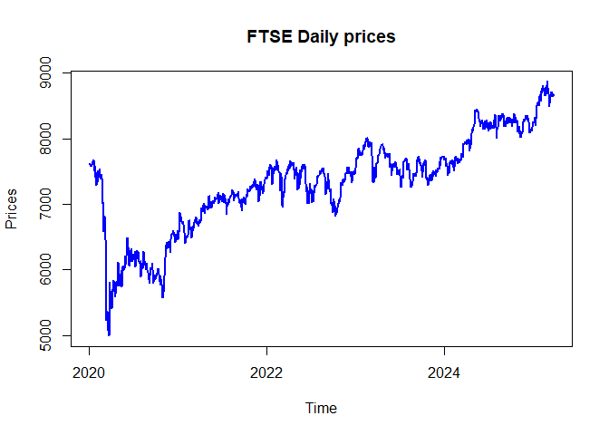
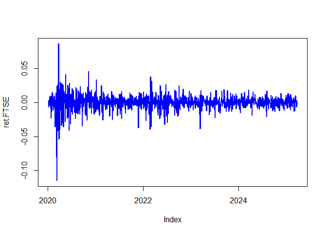
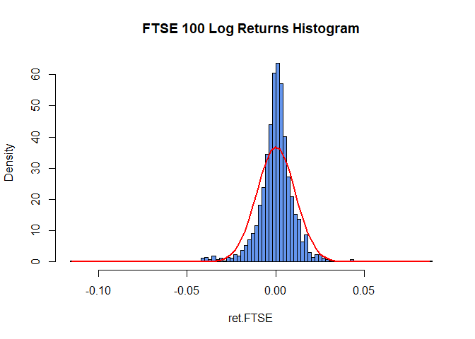
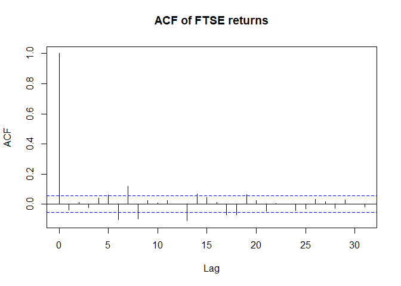
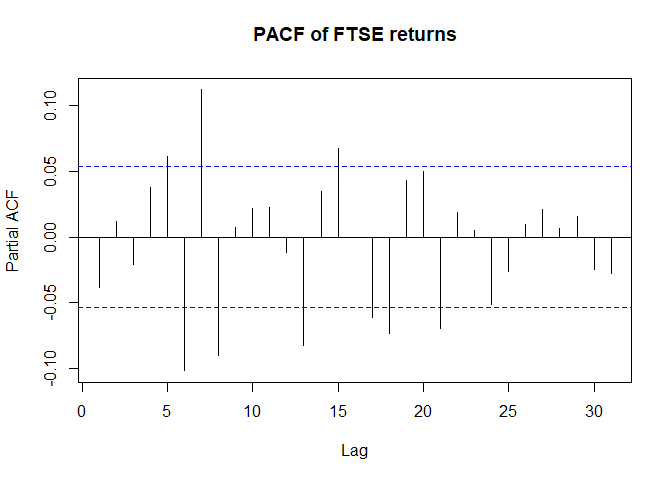
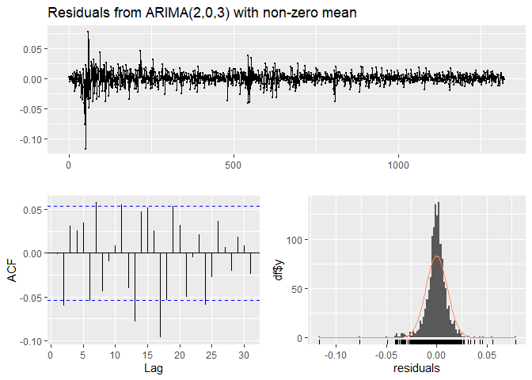
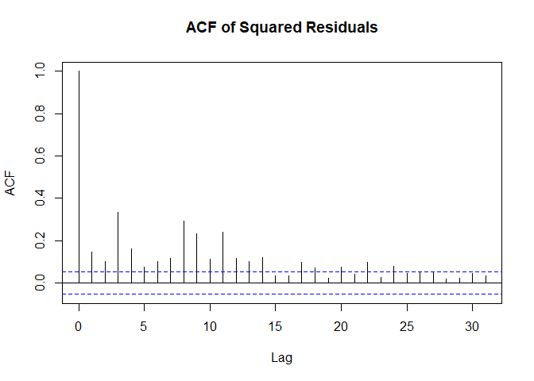
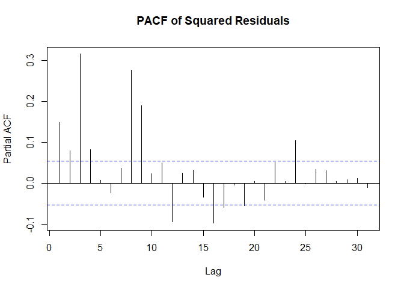
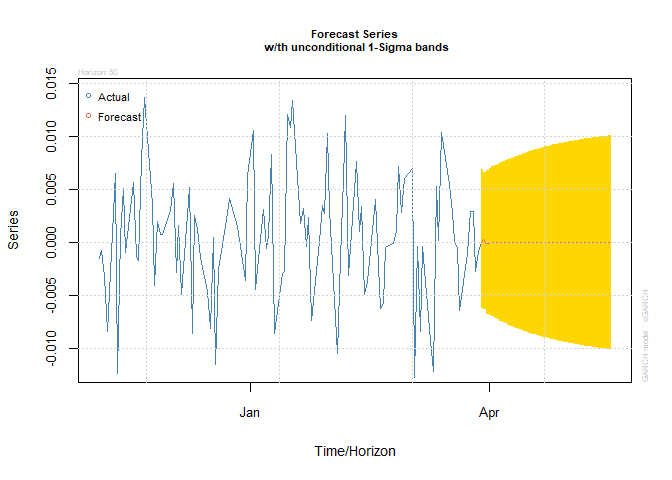
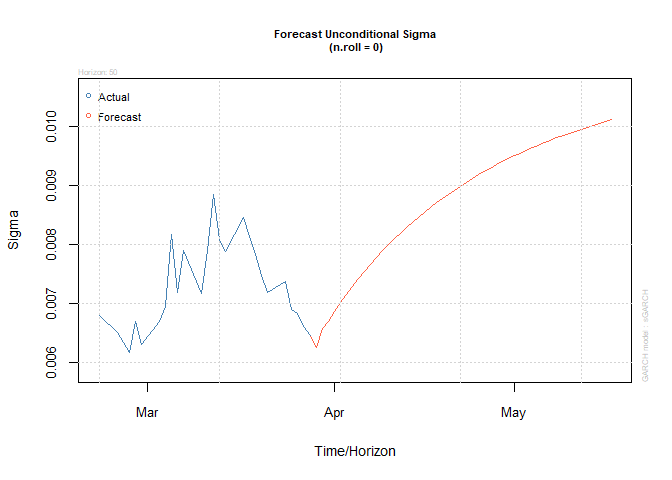

Analysis of FTSE100 using ARIMA-GARCH model
================
2025-03-29

I’ve recently started learning financial econometrics using R, and I’m
excited to apply my skills to real-world stock market data. For my first
analysis, I explored FTSE100 to examine volatility trends over the past
5 years. I used ARIMA-GARCH model for forecasting since the data
exhibited autocorrelation and volatility.

**libraries required**

``` r
library(quantmod)
```

    ## Warning: package 'quantmod' was built under R version 4.4.3

    ## Loading required package: xts

    ## Loading required package: zoo

    ## 
    ## Attaching package: 'zoo'

    ## The following objects are masked from 'package:base':
    ## 
    ##     as.Date, as.Date.numeric

    ## Loading required package: TTR

    ## Registered S3 method overwritten by 'quantmod':
    ##   method            from
    ##   as.zoo.data.frame zoo

``` r
library(urca)
```

    ## Warning: package 'urca' was built under R version 4.4.3

``` r
library(PerformanceAnalytics)
```

    ## Warning: package 'PerformanceAnalytics' was built under R version 4.4.3

    ## 
    ## Attaching package: 'PerformanceAnalytics'

    ## The following object is masked from 'package:graphics':
    ## 
    ##     legend

``` r
library(moments)
```

    ## 
    ## Attaching package: 'moments'

    ## The following objects are masked from 'package:PerformanceAnalytics':
    ## 
    ##     kurtosis, skewness

``` r
library(tseries)
```

    ## Warning: package 'tseries' was built under R version 4.4.3

``` r
library(forecast)
library(FinTS)
```

    ## Warning: package 'FinTS' was built under R version 4.4.3

    ## 
    ## Attaching package: 'FinTS'

    ## The following object is masked from 'package:forecast':
    ## 
    ##     Acf

``` r
library(rugarch)
```

    ## Warning: package 'rugarch' was built under R version 4.4.3

    ## Loading required package: parallel

    ## 
    ## Attaching package: 'rugarch'

    ## The following object is masked from 'package:stats':
    ## 
    ##     sigma

**Retrieve FTSE 100 stock index data**

``` r
getSymbols("^FTSE",from = "2020-01-01", to = Sys.Date())
```

    ## Warning: ^FTSE contains missing values. Some functions will not work if objects
    ## contain missing values in the middle of the series. Consider using na.omit(),
    ## na.approx(), na.fill(), etc to remove or replace them.

    ## [1] "FTSE"

**Checking and removing missing values**

``` r
sum(is.na(FTSE))
```

    ## [1] 6

``` r
FTSE <- na.omit(FTSE)
FTSE <- Ad(FTSE)
```

Plot of the daily prices to check for trends and basic understanding of
the time series data

``` r
plot.zoo(FTSE, main = "FTSE Daily prices",
        xlab = "Time",
        ylab = "Prices",
        lwd = 2,
        col = "blue")
```

<!-- -->
The plot shows an upward trend in prices, which indicates
non-stationarity. The significant drop in early 2020 is likely due to
COVID 19.

**Stationarity test**

Although it is obvious from the time series plot of FTSE100 prices that
data is not stationary. We still need to check statistically. We applied
Augmented Dickey Fuller test.

``` r
adf_FTSE = ur.df(FTSE, type = "drift", selectlags = "AIC")
summary(adf_FTSE)
```

    ## 
    ## ############################################### 
    ## # Augmented Dickey-Fuller Test Unit Root Test # 
    ## ############################################### 
    ## 
    ## Test regression drift 
    ## 
    ## 
    ## Call:
    ## lm(formula = z.diff ~ z.lag.1 + 1 + z.diff.lag)
    ## 
    ## Residuals:
    ##     Min      1Q  Median      3Q     Max 
    ## -646.60  -31.19    3.22   37.29  439.02 
    ## 
    ## Coefficients:
    ##              Estimate Std. Error t value Pr(>|t|)
    ## (Intercept) 26.041010  19.802840   1.315    0.189
    ## z.lag.1     -0.003445   0.002690  -1.281    0.200
    ## z.diff.lag  -0.021524   0.027571  -0.781    0.435
    ## 
    ## Residual standard error: 71.63 on 1318 degrees of freedom
    ## Multiple R-squared:  0.001803,   Adjusted R-squared:  0.0002886 
    ## F-statistic: 1.191 on 2 and 1318 DF,  p-value: 0.3044
    ## 
    ## 
    ## Value of test-statistic is: -1.2808 0.9033 
    ## 
    ## Critical values for test statistics: 
    ##       1pct  5pct 10pct
    ## tau2 -3.43 -2.86 -2.57
    ## phi1  6.43  4.59  3.78

The p-value is 0.3044 (greater than 0.05) and also the test - statistics
of -1.2808 is greater than the 3 critical values, hence we fail to
reject the null hypothesis that the data is not stationary.

**Calculate log returns**

We convert the non-stationary data into a stationary time series by
calculating log returns.

``` r
ret.FTSE = Return.calculate(FTSE, method = "log")[-1]
plot.zoo(ret.FTSE, lwd = 2, col = "blue")
```

<!-- -->

``` r
#Stationary test of log returns
adf2_FTSE = ur.df(ret.FTSE, type = "drift", selectlags = "AIC")
summary(adf2_FTSE)
```

    ## 
    ## ############################################### 
    ## # Augmented Dickey-Fuller Test Unit Root Test # 
    ## ############################################### 
    ## 
    ## Test regression drift 
    ## 
    ## 
    ## Call:
    ## lm(formula = z.diff ~ z.lag.1 + 1 + z.diff.lag)
    ## 
    ## Residuals:
    ##       Min        1Q    Median        3Q       Max 
    ## -0.115743 -0.004198  0.000447  0.004914  0.085009 
    ## 
    ## Coefficients:
    ##               Estimate Std. Error t value Pr(>|t|)    
    ## (Intercept)  0.0001037  0.0002985   0.347    0.728    
    ## z.lag.1     -1.0256890  0.0397013 -25.835   <2e-16 ***
    ## z.diff.lag  -0.0120582  0.0275503  -0.438    0.662    
    ## ---
    ## Signif. codes:  0 '***' 0.001 '**' 0.01 '*' 0.05 '.' 0.1 ' ' 1
    ## 
    ## Residual standard error: 0.01084 on 1317 degrees of freedom
    ## Multiple R-squared:  0.5192, Adjusted R-squared:  0.5185 
    ## F-statistic: 711.2 on 2 and 1317 DF,  p-value: < 2.2e-16
    ## 
    ## 
    ## Value of test-statistic is: -25.8351 333.7267 
    ## 
    ## Critical values for test statistics: 
    ##       1pct  5pct 10pct
    ## tau2 -3.43 -2.86 -2.57
    ## phi1  6.43  4.59  3.78

From the log returns plot, the trend in the data has been removed. The
likely shock from COVID 19 is seen in the volatility clustering around
2020. The volatility stabilizes but remains time varying. The ADF test
also indicates a p-value close to zero and the 3 critical values are
greater than the test statistic, reject the null hypothesis that the
data is not stationary.

**Descriptive stats**

``` r
summary(ret.FTSE)
```

    ##      Index            FTSE.Adjusted       
    ##  Min.   :2020-01-03   Min.   :-1.151e-01  
    ##  1st Qu.:2021-04-26   1st Qu.:-4.212e-03  
    ##  Median :2022-08-16   Median : 6.265e-04  
    ##  Mean   :2022-08-16   Mean   : 9.824e-05  
    ##  3rd Qu.:2023-12-06   3rd Qu.: 5.057e-03  
    ##  Max.   :2025-03-28   Max.   : 8.666e-02

``` r
skewness(ret.FTSE)
```

    ## FTSE.Adjusted 
    ##     -1.190647

``` r
kurtosis(ret.FTSE)
```

    ## FTSE.Adjusted 
    ##      19.69071

``` r
sd(ret.FTSE)
```

    ## [1] 0.01083861

The distribution and variability of the returns can be seen from the
measures provided. The mean(0.00009824) and median(0.0006265) returns
are centered around zero. Daily returns are between -0.1151 and 0.08666.
The returns are negatively skewed (-1.19), which indicates drops are
more severe than rises. High value of kurtosis (19.69) suggests that
return are more likely to deviate from normal distribution. The standard
deviation of returns of 0.0108 indicates a small volatility in daily
returns.

**Checking normality of returns**

``` r
hist(ret.FTSE, prob = T, breaks = 100,
      main = "FTSE 100 Log Returns Histogram",
      col = "cornflowerblue")
mu<-mean(ret.FTSE)
sigma<-sd(ret.FTSE)
x<-seq(min(ret.FTSE),max(ret.FTSE),length=80)
y<-dnorm(x,mu,sigma)
lines(x,y,lwd=2,col="red")
```

<!-- -->

``` r
#Jarque-Bera test for normality
jarque.bera.test(ret.FTSE)
```

    ## 
    ##  Jarque Bera Test
    ## 
    ## data:  ret.FTSE
    ## X-squared = 15657, df = 2, p-value < 2.2e-16

The histogram appears to be left skewed as confirmed from the
descriptive statistics. Since the p-value of the Jarque-Bera test is
close to zero, we reject the null hypothesis that the data is normally
distributed.

``` r
#Autocorrelation and Partial autocorrelation plot of returns
acf(ret.FTSE, main = "ACF of FTSE returns")
```

<!-- -->

``` r
pacf(ret.FTSE, main = "PACF of FTSE returns")
```

<!-- -->

``` r
#Autocorrelation check of returns
Box.test(ret.FTSE, lag = 10, type = "Ljung-Box", fitdf = 0)
```

    ## 
    ##  Box-Ljung test
    ## 
    ## data:  ret.FTSE
    ## X-squared = 55.639, df = 10, p-value = 2.398e-08

The ACF and PACF plots of returns have some significant spikes, but most
lags are within the confidence band. However, the Ljung-Box test shows a
p-value less than 0.05, hence we reject the null hypothesis of no
autocorrelation.

This suggests that the returns has some predictable structure. The
presence of autocorrelation may distort the ARCH test result.

We would use ARIMA model to remove the autocorrelation and apply the
ARCH effect on the residuals.

**Fitting ARIMA model**

``` r
fit <- auto.arima(ret.FTSE, ic = "aic", stepwise = FALSE, approximation = FALSE)
summary(fit)
```

    ## Series: ret.FTSE 
    ## ARIMA(2,0,3) with non-zero mean 
    ## 
    ## Coefficients:
    ##           ar1      ar2     ma1     ma2     ma3   mean
    ##       -1.5355  -0.8838  1.5184  0.9233  0.0229  1e-04
    ## s.e.   0.0560   0.0364  0.0659  0.0578  0.0389  3e-04
    ## 
    ## sigma^2 = 0.0001152:  log likelihood = 4121.45
    ## AIC=-8228.89   AICc=-8228.8   BIC=-8192.58
    ## 
    ## Training set error measures:
    ##                        ME       RMSE         MAE  MPE MAPE      MASE
    ## Training set 4.843247e-06 0.01070981 0.006971167 -Inf  Inf 0.6754032
    ##                      ACF1
    ## Training set -0.001796077

``` r
#Residuals of ARIMA model
checkresiduals(fit)
```

<!-- -->

    ## 
    ##  Ljung-Box test
    ## 
    ## data:  Residuals from ARIMA(2,0,3) with non-zero mean
    ## Q* = 19.977, df = 5, p-value = 0.001262
    ## 
    ## Model df: 5.   Total lags used: 10

``` r
#checking autocorrelation of residuals and squared residuals of ARIMA model
residuals = residuals(fit)
Box.test(residuals, lag = 10, type = "Ljung-Box", fitdf = 0)
```

    ## 
    ##  Box-Ljung test
    ## 
    ## data:  residuals
    ## X-squared = 19.977, df = 10, p-value = 0.02947

``` r
Box.test(residuals^2, lag = 10, type = "Ljung-Box", fitdf = 0)
```

    ## 
    ##  Box-Ljung test
    ## 
    ## data:  residuals^2
    ## X-squared = 465.33, df = 10, p-value < 2.2e-16

ARIMA(2,0,3) was suggested by the auto.arima function. The residuals of
the model indicates white noise and autocorrelation. Also,
autocorrelation is still present in squared residuals, which means there
is volatility clustering.

The returns will exhibit heteroscedasticity.

``` r
#check for ARCH effect (volatiltiy clustering)
ArchTest(ret.FTSE)
```

    ## 
    ##  ARCH LM-test; Null hypothesis: no ARCH effects
    ## 
    ## data:  ret.FTSE
    ## Chi-squared = 358.45, df = 12, p-value < 2.2e-16

The ARCH effect test shows a p-value close to zero, hence we reject the
null hypothesis of no ARCH effect.

Since, autocorrelation is still present in residuals of ARIMA model, we
can try to improve the ARIMA model. We can also try to model ARIMA and
GARCH together to address the autocorrelation and volatility clustering.

**Model using ARIMA-GARCH model**

``` r
#Checking for the lags for GARCH
acf(residuals^2, main="ACF of Squared Residuals")
```

<!-- -->

``` r
pacf(residuals^2, main="PACF of Squared Residuals")
```

<!-- -->
The ACF and PACF plot show significant lags. ACF lags are significant up
to lag 18 whereas PACF lags are significant up to lag 8. This indicates
persistent volatility clustering.

We would fit different GARCH models and select the best.

``` r
#Different GARCH model specification
spec1 <- ugarchspec(
  variance.model = list(model = "sGARCH", garchOrder = c(1, 1)),
  mean.model = list(armaOrder = c(3, 2), include.mean = FALSE),
  distribution.model = "std")
spec2 <- ugarchspec(
  variance.model = list(model = "sGARCH", garchOrder = c(2, 1)),
  mean.model = list(armaOrder = c(3, 2), include.mean = FALSE),
  distribution.model = "std")
spec3 <- ugarchspec(
  variance.model = list(model = "sGARCH", garchOrder = c(1, 2)),
  mean.model = list(armaOrder = c(3, 2), include.mean = FALSE),
  distribution.model = "std")
spec4 <- ugarchspec(
  variance.model = list(model = "sGARCH", garchOrder = c(2, 2)),
  mean.model = list(armaOrder = c(3, 2), include.mean = FALSE),
  distribution.model = "std")

#Fit the ARIMA-GARCH model
fit.garch.1 <- ugarchfit(spec = spec1, data = ret.FTSE)
fit.garch.2 <- ugarchfit(spec = spec2, data = ret.FTSE)
fit.garch.3 <- ugarchfit(spec = spec3, data = ret.FTSE)
fit.garch.4 <- ugarchfit(spec = spec4, data = ret.FTSE)

#Model selection using information critarion
model.list = list("garch(1,1)" = fit.garch.1,
                  "garch(2,1)" = fit.garch.2,
                  "garch(1,2)" = fit.garch.3,
                  "garch(2,2)" = fit.garch.4)
model.mat = sapply(model.list, infocriteria)
rownames(model.mat) = rownames(infocriteria(fit.garch.1))
model.mat
```

    ##              garch(1,1) garch(2,1) garch(1,2) garch(2,2)
    ## Akaike        -6.714668  -6.713155  -6.714864  -6.713351
    ## Bayes         -6.679356  -6.673920  -6.675629  -6.670193
    ## Shibata       -6.714760  -6.713268  -6.714978  -6.713488
    ## Hannan-Quinn  -6.701430  -6.698446  -6.700155  -6.697172

GARCH(1,2) has the best fit.

``` r
#Diagnostic checking of residuals of ARIMA-GARCH model
residuals.2 <- residuals(fit.garch.3, standardize = TRUE)

Box.test(residuals.2, lag = 10, type = "Ljung-Box", fitdf = 0)
```

    ## 
    ##  Box-Ljung test
    ## 
    ## data:  residuals.2
    ## X-squared = 5.5118, df = 10, p-value = 0.8545

``` r
Box.test(residuals.2^2, lag = 10, type = "Ljung-Box", fitdf = 0)
```

    ## 
    ##  Box-Ljung test
    ## 
    ## data:  residuals.2^2
    ## X-squared = 8.0317, df = 10, p-value = 0.6257

The autocorrelation in the residuals and squared residuals show p-value
greater than 0.05, no autocorrelation. This suggests that the model
captured the volatility clustering as well as the linear dependencies.

**forecasting garch(1,2)**

``` r
forecast <- ugarchforecast(fit.garch.3, n.ahead = 50)
plot(forecast, which = 1)
```

<!-- -->

``` r
plot(forecast, which = 3)
```

<!-- -->
